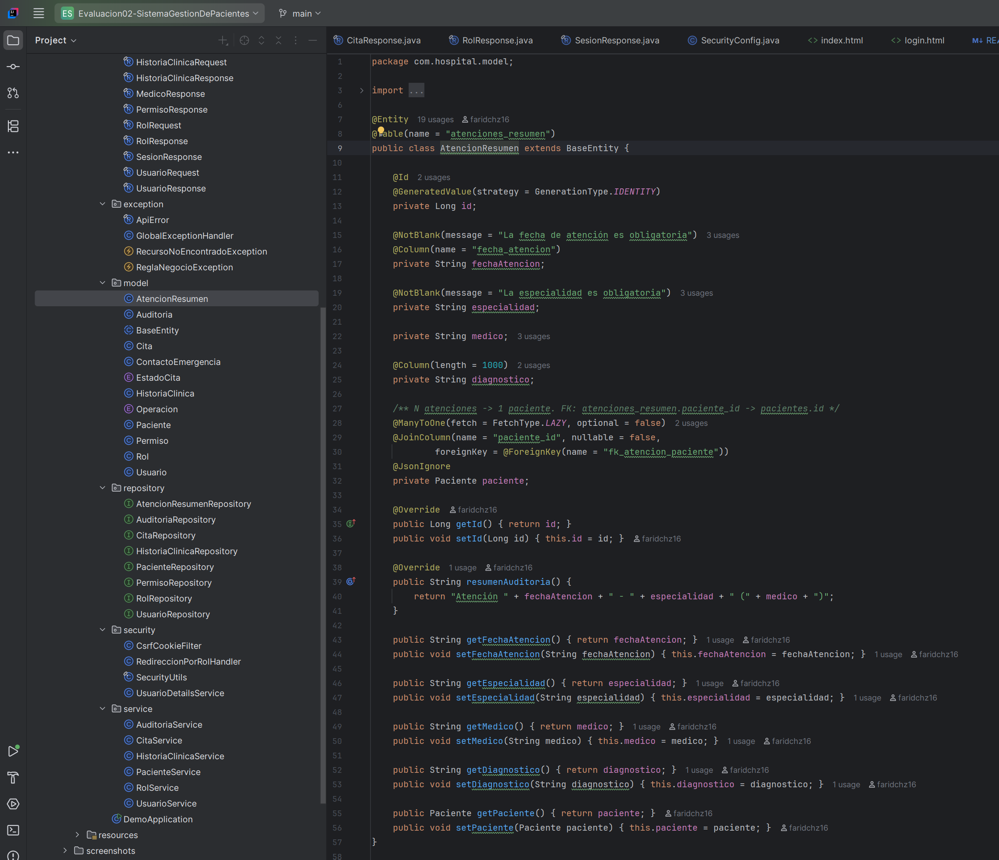
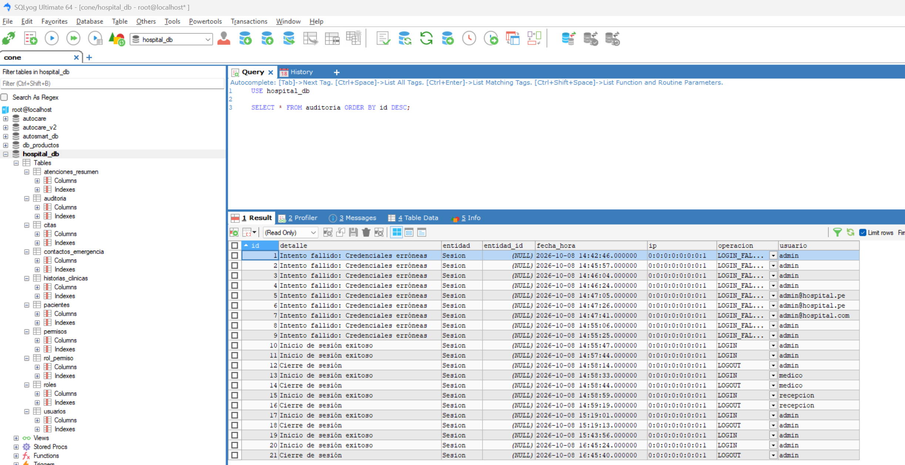
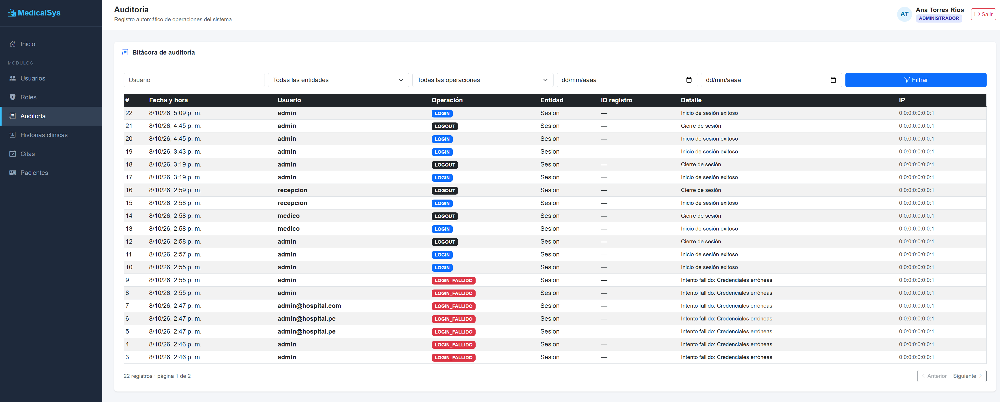
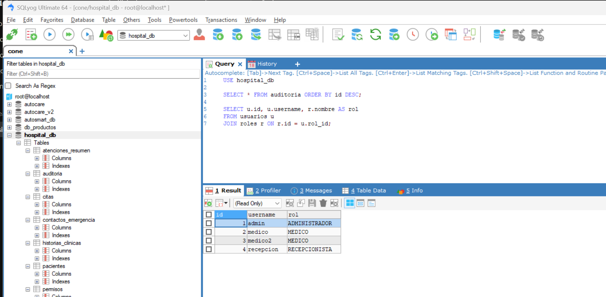
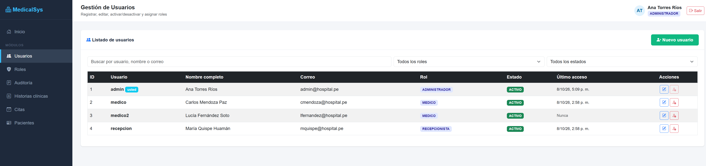
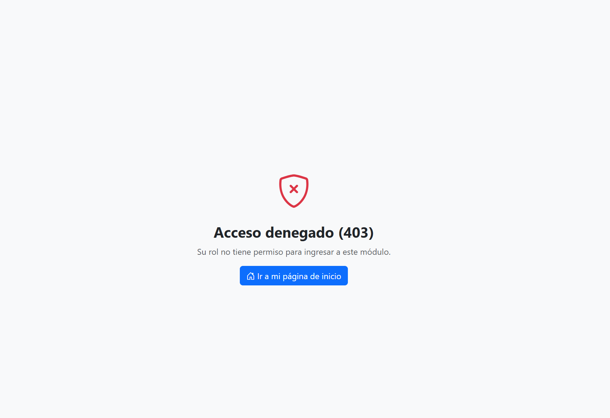

# Sistema de Gestión de Pacientes (MedicalSys) - Evaluación 02

**Curso:** Desarrollo de Aplicaciones Web - 4.° ciclo

A partir del proyecto de la Evaluación 01, se implementaron relaciones con Hibernate/JPA, auditoría con AOP, gestión de usuarios y roles, interfaces web y control de acceso con Spring Security.

---

## Tecnologías

| Componente | Detalle |
|---|---|
| Lenguaje | Java 17 |
| Framework | Spring Boot 4.1.1 |
| Persistencia | Spring Data JPA / Hibernate, MySQL (`hospital_db`) |
| Seguridad | Spring Security (formLogin, BCrypt, CSRF por cookie) |
| AOP | Spring AOP / AspectJ |
| Validaciones | Jakarta Bean Validation |
| Frontend | HTML5, CSS3, Bootstrap 5.3, JavaScript (Fetch API) |
| Herramientas | IntelliJ IDEA, MySQL, SQLyog, Postman, Git y GitHub |

## Cómo ejecutar

1. Iniciar MySQL. No hace falta crear tablas: `ddl-auto=update` crea las nuevas y agrega columnas sin borrar datos.
2. En IntelliJ: **Maven > Reload project** y ejecutar `DemoApplication`.
3. Ingresar a **http://localhost:8081**, que redirige al inicio de sesión.

Al arrancar, `DataInitializer` carga (solo si no existen) los módulos, los roles y estos usuarios de prueba:

| Usuario | Contraseña | Rol | Página de inicio tras el login |
|---|---|---|---|
| `admin` | `Admin2026` | ADMINISTRADOR | Usuarios |
| `medico` / `medico2` | `Medico2026` | MEDICO | Historias clínicas |
| `recepcion` | `Recepcion2026` | RECEPCIONISTA | Citas |

## Pregunta 1. Relaciones con Hibernate/JPA

| Relación | Anotación | Clave foránea / integridad | Archivo |
|---|---|---|---|
| Paciente - HistoriaClinica | `@OneToOne` | `historias_clinicas.paciente_id` **UNIQUE** + `fk_historia_paciente` | `HistoriaClinica.java` |
| Paciente - Contactos de emergencia | `@OneToMany(cascade=ALL, orphanRemoval)` / `@ManyToOne` | `fk_contacto_paciente` | `Paciente.java`, `ContactoEmergencia.java` |
| Paciente - Atenciones | `@OneToMany` / `@ManyToOne` | `fk_atencion_paciente` | `AtencionResumen.java` |
| Cita - Paciente y Cita - Usuario (médico) | `@ManyToOne` x2 | `fk_cita_paciente`, `fk_cita_medico` | `Cita.java` |
| Usuario - Rol | `@ManyToOne` / `@OneToMany(mappedBy)` | `fk_usuario_rol` (NOT NULL) | `Usuario.java`, `Rol.java` |
| Rol - Permiso | `@ManyToMany` + `@JoinTable(rol_permiso)` | `fk_rolpermiso_rol`, `fk_rolpermiso_permiso` | `Rol.java` |

**Reglas de integridad (en la capa de servicio):**
- El número de documento de paciente, el usuario y el correo son únicos.
- Un paciente tiene una sola historia clínica.
- Un médico no puede tener dos citas en el mismo horario (las citas canceladas liberan el horario).
- Solo se asignan médicos activos con rol MEDICO.
- Un paciente inactivo no recibe citas ni atenciones.
- Una cita ya atendida no se puede eliminar.
- El paciente se elimina de forma **lógica** (estado INACTIVO) porque tiene historia, citas y atenciones asociadas.

**CRUD con relaciones:** `pacientes.html` (paciente con N contactos), `historias.html` (historia 1:1 y atenciones 1:N) y `citas.html` (paciente y médico).

### Evidencia

Código de las entidades con las anotaciones `@OneToOne`, `@ManyToOne`, `@OneToMany` y `@ManyToMany`:

---

## Pregunta 2. Auditoría

Se implementó en dos niveles.

**1. Bitácora con AOP (tabla `auditoria`).** Los métodos de servicio se anotan con `@Auditable`:

`AuditoriaAspect` (`@Aspect` con `@AfterReturning`) graba automáticamente:

| Campo | Contenido |
|---|---|
| `usuario` | Usuario autenticado que realizó la operación |
| `fecha_hora` | Fecha y hora |
| `operacion` | REGISTRAR, MODIFICAR, ELIMINAR, ACTIVAR, DESACTIVAR, LOGIN, LOGIN_FALLIDO, LOGOUT |
| `entidad` | Entidad afectada (Paciente, Cita, Usuario, Rol, HistoriaClinica, AtencionResumen) |
| `entidad_id` | Identificador del registro afectado |
| `detalle`, `ip` | Resumen del registro y dirección IP |

El aspecto se ejecuta dentro de la misma transacción del servicio: si la operación falla y hace rollback, tampoco queda un registro de auditoría falso. `LoginAuditListener` registra los inicios de sesión, los intentos fallidos y los cierres de sesión.

**2. Auditoría por registro (Spring Data JPA Auditing).** `BaseEntity` agrega `creado_por`, `fecha_creacion`, `modificado_por` y `fecha_modificacion` a las entidades principales.

La bitácora se consulta desde **Auditoría** (`auditoria.html`, solo ADMINISTRADOR), con filtros y paginación.

### Evidencia

Tabla `auditoria` en MySQL con registros generados automáticamente:

Pantalla de Auditoría del sistema con las operaciones de registro, modificación y eliminación:

---

## Pregunta 3. Gestión de usuarios y roles

**Usuarios** (`/api/usuarios`): registrar, listar, editar, activar/desactivar y asignar rol.
- Contraseña cifrada con **BCrypt**.
- Política mínima: 8 caracteres, con letras y números.
- Usuario y correo únicos.

**Roles** (`/api/roles`): registrar, listar, editar, activar/desactivar y asignar los módulos (permisos) a los que accede cada rol.

**Roles base:** ADMINISTRADOR, MEDICO y RECEPCIONISTA.

**Relaciones JPA:** `Usuario` `@ManyToOne` `Rol`, y `Rol` `@ManyToMany` `Permiso` (tabla intermedia `rol_permiso`).

**Protecciones implementadas:**
- El administrador no puede desactivarse a sí mismo ni cambiar su propio rol.
- El rol ADMINISTRADOR no se puede desactivar ni renombrar, ni perder los módulos Usuarios y Roles.
- Un usuario cuyo rol está inactivo no puede iniciar sesión.
- No se puede asignar un rol inactivo.

### Evidencia

Relación Usuario–Rol en la base de datos (consulta con `JOIN` entre `usuarios` y `roles`):

---

## Pregunta 4. Frontend de usuarios y roles

| Página | Contenido |
|---|---|
| `login.html` | Inicio de sesión con mensajes de error, usuario inactivo y cierre de sesión |
| `usuarios.html` | Listado con filtros, formulario de registro y edición (modal), combo de rol y activar/desactivar |
| `roles.html` | Listado con módulos y número de usuarios, formulario de registro y edición con checkboxes de módulos, y activar/desactivar |
| `pacientes.html`, `historias.html`, `citas.html`, `auditoria.html` | Módulos del sistema |

Todas las páginas usan `js/app.js`, que arma el menú según los módulos del usuario, envía el token CSRF y muestra los mensajes de error del backend. Las operaciones se hacen desde la interfaz, sin tocar la base de datos.

### Evidencia

Gestión de usuarios: listado, edición y selección de rol:

---

## Pregunta 5. Control de acceso según el rol

| Rol | Módulos | Página de inicio |
|---|---|---|
| ADMINISTRADOR | Usuarios, Roles, Auditoría, Historias, Citas, Pacientes | `usuarios.html` |
| MEDICO | Historias clínicas, Pacientes | `historias.html` |
| RECEPCIONISTA | Citas, Pacientes | `citas.html` |

**Mostrar solo lo permitido:** el menú se construye con `GET /api/auth/me`, que devuelve los módulos del rol del usuario autenticado.

**Impedir el acceso (validación en el backend, en dos capas):**
1. `SecurityConfig`: cada página `.html` y cada `/api/**` exige el authority del módulo (`hasAuthority('USUARIOS')`, etc.).
    - Si la página no está permitida, redirige a `403.html`.
    - Si es una API, responde 403 en JSON.
2. `@PreAuthorize` en cada controlador (`@EnableMethodSecurity`).

**Redirección tras el login:** `RedireccionPorRolHandler` envía a cada rol a su primer módulo permitido.

### Evidencia

Usuario con rol MEDICO intentando entrar a `/usuarios.html` y siendo bloqueado con `403.html`:

---

## Validaciones y manejo de errores

- **Validaciones (Bean Validation):** `@NotBlank`, `@Size`, `@Email`, `@Past`, `@Pattern` y `@NotNull` en entidades y DTOs, activadas con `@Valid` en los controladores.
- **Manejo global:** `GlobalExceptionHandler` (`@RestControllerAdvice`) devuelve un JSON uniforme (`ApiError`):

| Excepción | Código HTTP |
|---|---|
| Datos inválidos | 400 |
| Recurso no encontrado | 404 |
| Regla de negocio / violación de integridad | 409 |
| Acceso denegado | 403 |
| Error interno | 500 |

## Endpoints principales

| Método | URL | Permiso |
|---|---|---|
| GET | `/api/auth/me` | autenticado |
| GET, POST, PUT, PATCH | `/api/usuarios`, `/api/usuarios/{id}`, `/api/usuarios/{id}/estado?activo=` | USUARIOS |
| GET, POST, PUT, PATCH | `/api/roles`, `/api/roles/{id}`, `/api/roles/{id}/estado?activo=` y GET `/api/permisos` | ROLES |
| GET, POST, PUT, PATCH | `/api/pacientes?q=`, `/api/pacientes/{id}`, `/api/pacientes/{id}/estado?activo=` | PACIENTES |
| GET, POST, PUT, DELETE | `/api/pacientes/{id}/atenciones[/{atencionId}]` | HISTORIAS |
| GET, POST, PUT | `/api/historias/paciente/{pacienteId}` | HISTORIAS |
| GET, POST, PUT, PATCH, DELETE | `/api/citas`, `/api/citas/{id}`, `/api/citas/{id}/estado?estado=`, `/api/citas/medicos` | CITAS |
| GET | `/api/auditoria?usuario=&entidad=&operacion=&desde=&hasta=&page=` | AUDITORIA |

